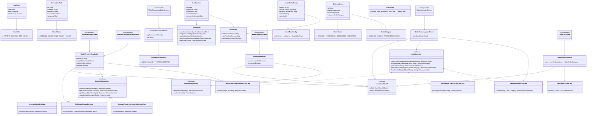

# CoverDesign — UML (main flows)

Three flows: 3D model generation · rehabilitation recommendation · insole ordering.

```mermaid
classDiagram
    %% ── BASE ────────────────────────────────────────────────────────────────────
    class BaseViewModel {
        <<abstract>>
        +uiState StateFlow~UiState~
        +events SharedFlow~UiEvent~
    }
    class AppUser {
        +uid String
        +role UserRole
        +hasInsoles Boolean
    }
    class UserRole { <<enumeration>> PATIENT · DOCTOR · TECHNICIAN }
    class FireAuthRepository {
        <<interface>>
        +getUserProfile(String) Resource~AppUser~
        +isAuthenticated() Flow~Boolean~
    }

    %% ── FLOW 1 · 3D MODEL GENERATION ───────────────────────────────────────────
    class GenerationTask {
        +id String
        +configId String
        +modelUrl String
        +status ModelStatus
        +progress Float
    }
    class ModelStatus { <<enumeration>> PENDING · GENERATING · READY · FAILED }
    class Model3DRepository {
        <<interface>>
        +submitGeneration(request) Resource~String~
        +getGenerationStatus(taskId) Resource~GenerationTask~
        +getAdaptedModel(configId) Resource~GenerationTask~
        +saveModel(GenerationTask) Resource~Unit~
    }
    class GenerateModelUseCase        { +invoke(ProductConfig) Resource~String~ }
    class GenerateProstheticCoverModelUseCase { +invoke(request) Resource~String~ }
    class PollModelStatusUseCase      { +invoke(taskId) Flow~Resource~GenerationTask~~ }
    class LinkOrderToAdaptedModelUseCase { +invoke(configId, modelId) Resource~Unit~ }
    class ModelPreviewViewModel {
        +modelUrl String
        +modelStatus ModelStatus
        +isGenerating Boolean
        +isReady Boolean
    }
    class ModelPreviewScreen          { <<Composable>> }
    class ModifiableModelPreviewScreen { <<Composable>> }

    %% ── FLOW 2 · REHABILITATION / RECOMMENDATION ────────────────────────────────
    class GaitSession {
        +id String
        +patientUid String
        +timestamp Long
        +report GaitReport
        +pressureData InsoleData
    }
    class GaitReport {
        +typicalInclinations Map~GaitMetricKey, Float~
        +sampleCounts Map~GaitMetricKey, Int~
        +qualifiedMetrics Set~GaitMetricKey~
        +measurementMethod GaitMeasurementMethod
        +acquisitionSource GaitAcquisitionSource
    }
    class InsoleData {
        +leftFoot FootPressureMap
        +rightFoot FootPressureMap
        +copTrajectory List~CopPoint~
    }
    class DoctorRecommendation {
        +tag RecommendationTag
        +text String
    }
    class RecommendationTag { <<enumeration>> INSOLE_BASED · PHOTOGRAMMETRIC }
    class RehabViewModel {
        +sessions List~GaitSession~
        +hasInsoles Boolean
    }
    class RehabHistoryScreen        { <<Composable>> }
    class WriteRecommendationScreen { <<Composable>> }

    %% ── FLOW 3 · INSOLE ORDERING ────────────────────────────────────────────────
    class InsoleOrderConfig {
        +orderId String
        +leftFoot InsoleFootConfig
        +rightFoot InsoleFootConfig
        +material String
        +quantity Int
    }
    class InsoleFootConfig { +side String · +euSize Int · +lengthMm Float }
    class OrderListItem {
        +id String
        +status OrderStatus
        +totalPrice Double
        +category OrderCategory
    }
    class OrderDetail    { <<sealed>> InsoleOrder · ProstheticCoverOrder · CatalogOrder }
    class OrderStatus    { <<enumeration>> PENDING · PROCESSING · COMPLETED · SUBMITTED }
    class OrderCategory  { <<enumeration>> CATALOG · INSOLE · PROSTHETIC_COVER }
    class OrderRepository {
        <<interface>>
        +saveInsoleOrderLocally(InsoleOrderConfig) Resource~Unit~
        +submitInsoleOrder(InsoleOrderConfig) Resource~String~
        +getOrderListItems() Flow~List~OrderListItem~~
        +getOrderDetailById(String, OrderCategory) Resource~OrderDetail~
        +linkOrderToAdaptedModel(String, String) Resource~Unit~
    }
    class SaveInsoleOrderLocallyUseCase { +invoke(InsoleOrderConfig) Resource~Unit~ }
    class GetOrderListUseCase           { +invoke() Flow~List~OrderListItem~~ }
    class GetOrderDetailUseCase         { +invoke(String, OrderCategory) Resource~OrderDetail~ }
    class OrderListViewModel  { +orders List~OrderListItem~ · +filter OrderCategory }
    class OrderSummaryViewModel { +orderDetail OrderDetail }
    class OrderListScreen    { <<Composable>> }
    class OrderSummaryScreen { <<Composable>> }

    %% ── RELATIONSHIPS ────────────────────────────────────────────────────────────
    AppUser --> UserRole
    GenerationTask --> ModelStatus
    Model3DRepository <.. GenerateModelUseCase
    Model3DRepository <.. GenerateProstheticCoverModelUseCase
    Model3DRepository <.. PollModelStatusUseCase
    OrderRepository <.. LinkOrderToAdaptedModelUseCase
    ModelPreviewViewModel --|> BaseViewModel
    ModelPreviewViewModel --> PollModelStatusUseCase
    ModelPreviewViewModel --> Model3DRepository
    ModelPreviewViewModel --> LinkOrderToAdaptedModelUseCase
    ModelPreviewScreen --> ModelPreviewViewModel
    ModifiableModelPreviewScreen --> ModelPreviewViewModel

    GaitSession --> GaitReport
    GaitSession --> InsoleData
    DoctorRecommendation --> RecommendationTag
    RehabViewModel --|> BaseViewModel
    RehabViewModel --> FireAuthRepository
    RehabHistoryScreen --> RehabViewModel
    WriteRecommendationScreen --> DoctorRecommendation

    InsoleOrderConfig --> InsoleFootConfig
    InsoleOrderConfig --> InsoleData
    OrderListItem --> OrderStatus
    OrderListItem --> OrderCategory
    OrderRepository <.. SaveInsoleOrderLocallyUseCase
    OrderRepository <.. GetOrderListUseCase
    OrderRepository <.. GetOrderDetailUseCase
    OrderListViewModel --|> BaseViewModel
    OrderListViewModel --> GetOrderListUseCase
    OrderSummaryViewModel --|> BaseViewModel
    OrderSummaryViewModel --> OrderRepository
    OrderSummaryViewModel --> GetOrderDetailUseCase
    OrderListScreen --> OrderListViewModel
    OrderSummaryScreen --> OrderSummaryViewModel
```
